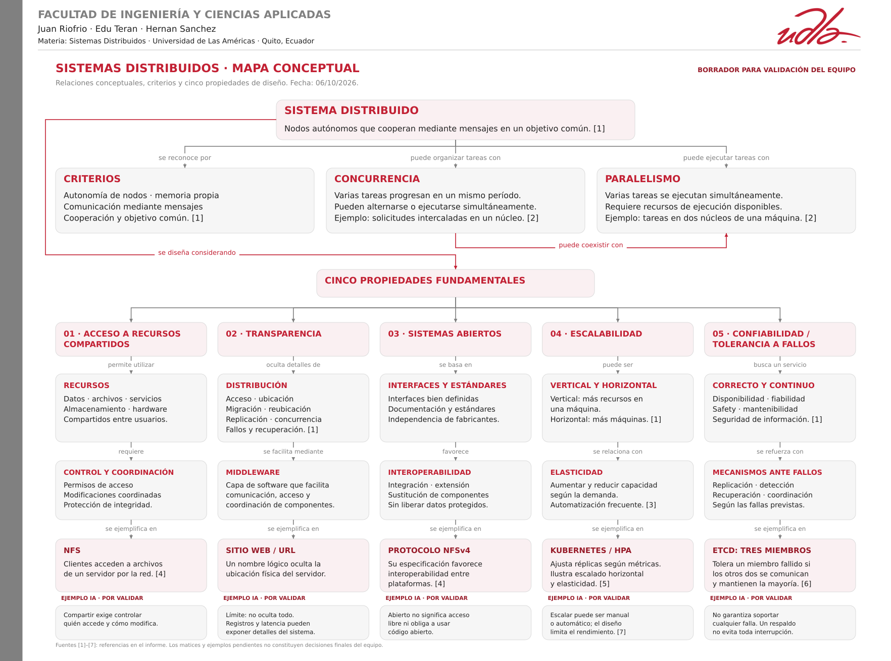

# Sistemas Distribuidos — UDLA

**Integrantes:** Juan Riofrio · Edu Teran · Hernan Sanchez  
**Materia:** Sistemas Distribuidos  
**Fecha:** 6 de octubre de 2026

[**Abrir el mapa conceptual en PDF**](Mapa_Conceptual_Sistemas_Distribuidos_Borrador.pdf)  
[Descargar la versión SVG editable](Mapa_Conceptual_Sistemas_Distribuidos_Borrador.svg)

El mapa relaciona los criterios de un sistema distribuido, concurrencia y paralelismo, y las cinco propiedades: acceso a recursos compartidos, transparencia, sistemas abiertos, escalabilidad y confiabilidad/tolerancia a fallos.

**Estado:** borrador para validación del equipo. Los ejemplos y matices señalados como pendientes requieren la revisión humana documentada en la bitácora del informe.

## Referencias del mapa

1. Benalcázar, J. (2026). *Clase 2. Sistemas distribuidos* [Diapositivas]. Material proporcionado para la actividad.
2. Gerrand, A. (2013). [Concurrency is not parallelism](https://go.dev/blog/waza-talk). The Go Blog.
3. NIST. [Rapid elasticity](https://csrc.nist.gov/glossary/term/rapid_elasticity).
4. Haynes, T., y Noveck, D. (2015). [Network File System (NFS) Version 4 Protocol — RFC 7530](https://www.rfc-editor.org/rfc/rfc7530).
5. Kubernetes. [Horizontal Pod Autoscaling](https://kubernetes.io/docs/concepts/workloads/autoscaling/horizontal-pod-autoscale/).
6. etcd. [FAQ — v3.6](https://etcd.io/docs/v3.6/faq/).
7. Amazon Web Services. [Choose your scaling method](https://docs.aws.amazon.com/autoscaling/ec2/userguide/scaling-overview.html).
